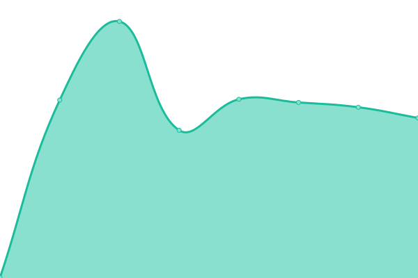

# [📈 Live Status](https://uptime.designinformatics.org): <!--live status--> **🟧 Partial outage**

This repository contains the open-source uptime monitor and status page for [Design Informatics](https://www.designinformatics.org/), powered by [Upptime](https://github.com/upptime/upptime).

With [Upptime](https://upptime.js.org), you can get your own unlimited and free uptime monitor and status page, powered entirely by a GitHub repository. We use [Issues](https://github.com/Edinburgh-College-of-Art/DI-upptime/issues) as incident reports, [Actions](https://github.com/Edinburgh-College-of-Art/DI-upptime/actions) as uptime monitors, and [Pages](https://uptime.designinformatics.org) for the status page.

<!--start: status pages-->
<!-- This summary is generated by Upptime (https://github.com/upptime/upptime) -->
<!-- Do not edit this manually, your changes will be overwritten -->
<!-- prettier-ignore -->
| URL | Status | History | Response Time | Uptime |
| --- | ------ | ------- | ------------- | ------ |
|  [Design Informatics](https://designinformatics.org) | 🟩 Up | [design-informatics.yml](https://github.com/Edinburgh-College-of-Art/DI-upptime/commits/HEAD/history/design-informatics.yml) | 

 2843ms
     
 | 

<a href="https://uptime.designinformatics.org/history/design-informatics">99.55%</a>
    

|  [Ripple Framework](https://ripple.designinformatics.org) | 🟩 Up | [ripple-framework.yml](https://github.com/Edinburgh-College-of-Art/DI-upptime/commits/HEAD/history/ripple-framework.yml) | 

 642ms
     
 | 

<a href="https://uptime.designinformatics.org/history/ripple-framework">100.00%</a>
    

|  [FIRE App](https://fire-app.designinformatics.org) | 🟩 Up | [fire-app.yml](https://github.com/Edinburgh-College-of-Art/DI-upptime/commits/HEAD/history/fire-app.yml) | 

 482ms
     
 | 

<a href="https://uptime.designinformatics.org/history/fire-app">100.00%</a>
    

|  [A Token Gesture](https://nft.inspace.ed.ac.uk) | 🟩 Up | [a-token-gesture.yml](https://github.com/Edinburgh-College-of-Art/DI-upptime/commits/HEAD/history/a-token-gesture.yml) | 

 770ms
     
 | 

<a href="https://uptime.designinformatics.org/history/a-token-gesture">100.00%</a>
    

|  [A Token Gesture (DI)](https://nft.designinformatics.org) | 🟩 Up | [a-token-gesture-di.yml](https://github.com/Edinburgh-College-of-Art/DI-upptime/commits/HEAD/history/a-token-gesture-di.yml) | 

 487ms
     
 | 

<a href="https://uptime.designinformatics.org/history/a-token-gesture-di">100.00%</a>
    

|  [GeoCoin](https://geocoin.designinformatics.org) | 🟥 Down | [geo-coin.yml](https://github.com/Edinburgh-College-of-Art/DI-upptime/commits/HEAD/history/geo-coin.yml) | 

 17126ms
     
 | 

<a href="https://uptime.designinformatics.org/history/geo-coin">10.46%</a>
    

|  [Ticket Designer](https://ticket-designer.designinformatics.org) | 🟩 Up | [ticket-designer.yml](https://github.com/Edinburgh-College-of-Art/DI-upptime/commits/HEAD/history/ticket-designer.yml) | 

 467ms
     
 | 

<a href="https://uptime.designinformatics.org/history/ticket-designer">100.00%</a>
    

|  [VizBlocks Website](https://vizblocks.creativeinformatics.org) | 🟩 Up | [viz-blocks-website.yml](https://github.com/Edinburgh-College-of-Art/DI-upptime/commits/HEAD/history/viz-blocks-website.yml) | 

 208ms
     
 | 

<a href="https://uptime.designinformatics.org/history/viz-blocks-website">100.00%</a>
    

|  [VisTools](https://vistools.net) | 🟥 Down | [vis-tools.yml](https://github.com/Edinburgh-College-of-Art/DI-upptime/commits/HEAD/history/vis-tools.yml) | 

 0ms
     
 | 

<a href="https://uptime.designinformatics.org/history/vis-tools">0.00%</a>
    

|  [TNRO](https://observatory.newreal.cc) | 🟥 Down | [tnro.yml](https://github.com/Edinburgh-College-of-Art/DI-upptime/commits/HEAD/history/tnro.yml) | 

 445ms
     
 | 

<a href="https://uptime.designinformatics.org/history/tnro">0.00%</a>
    

|  [AWEN Website](https://www.awen.earth) | 🟥 Down | [awen-website.yml](https://github.com/Edinburgh-College-of-Art/DI-upptime/commits/HEAD/history/awen-website.yml) | 

 0ms
     
 | 

<a href="https://uptime.designinformatics.org/history/awen-website">0.00%</a>
    

|  [AWEN App](https://walk.awen.earth) | 🟩 Up | [awen-app.yml](https://github.com/Edinburgh-College-of-Art/DI-upptime/commits/HEAD/history/awen-app.yml) | 

 567ms
     
 | 

<a href="https://uptime.designinformatics.org/history/awen-app">100.00%</a>
    

|  [TRoll](https://toiletroll.chrisspeed.net) | 🟩 Up | [t-roll.yml](https://github.com/Edinburgh-College-of-Art/DI-upptime/commits/HEAD/history/t-roll.yml) | 

 377ms
     
 | 

<a href="https://uptime.designinformatics.org/history/t-roll">100.00%</a>
    

|  [Ripple](https://ripple.designinformatics.org) | 🟩 Up | [ripple.yml](https://github.com/Edinburgh-College-of-Art/DI-upptime/commits/HEAD/history/ripple.yml) | 

 534ms
     
 | 

<a href="https://uptime.designinformatics.org/history/ripple">100.00%</a>
    

|  [ORA API](https://ora-api.designinformatics.org) | 🟩 Up | [ora-api.yml](https://github.com/Edinburgh-College-of-Art/DI-upptime/commits/HEAD/history/ora-api.yml) | 

 407ms
     
 | 

<a href="https://uptime.designinformatics.org/history/ora-api">100.00%</a>
    

|  [CDA](https://cda.designinformatics.org) | 🟥 Down | [cda.yml](https://github.com/Edinburgh-College-of-Art/DI-upptime/commits/HEAD/history/cda.yml) | 

 476ms
     
 | 

<a href="https://uptime.designinformatics.org/history/cda">0.00%</a>
    

<!--end: status pages-->

[**Visit our status website →**](https://uptime.designinformatics.org)

## 📄 License

- Powered by: [Upptime](https://github.com/upptime/upptime)
- Code: [MIT](./LICENSE) © [Evan](you-rhythmic.com)
- Data in the `./history` directory: [Open Database License](https://opendatacommons.org/licenses/odbl/1-0/)
